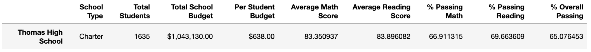

# School_District_Analysis
Analyzing testing scores for schools within a district to uncover trends. 

## Overview of the school district analysis
Working with the data scientists for school district, this analysis dives into the standardized test schools and allocated school budgets to showcase trends in school performance. These trends will help the superintendent make informed decisions around school budget allotments. 

Working through different key metrics, it came to our attetion that there may be some academic dishonesty at one of the schools. In order to help improve the accuracy of this analysis, part of the school data for Thomas High School has been replaced with NaN. Only 9th grade math & reading scores were changed to NaN in order to increase data accuracy. 

## Results
In our original analysis these are the key metrics that were measured:
  * The district summary
  * The school summary
  * The top 5 and bottom 5 performing schools, based on the overall passing rate
  * The average math score for each grade level from each school
  * The average reading score for each grade level from each school
  * The scores by school spending per student, by school size, and by school type

With the data for 9th grade student's reading & math scores at Thomas High School, all of these metrics were affected. Our dataset needed to exclude any of the 9th grader's math & reading scores from Thomas High, and reran to show more accurate key metrics. 9th graders account for 28% of the students at Thomas High School. That means prior to the data adjustment over 1/4 of their reading & math scores were incorrect and impacted metric calculations.  Here is an explanation how each metric was affected by the academic dishonesty. 
  * The district summary - This summary combined all school metrics to have 1 district summer. Math, reading & overall scores were now inaccurate.  
  * The school summary - Similary the math, reading and overall scores were inaccurate for Thomas High School. 
  * The top 5 and bottom 5 performing schools, based on the overall passing rate - Thomas High Schools rank among other schools were impacted 
  * The average math score for each grade level from each school - The total average math school was impacted
  * The average reading score for each grade level from each school - The total average reading score was impacted 
  * The scores by school spending per student, by school size, and by school type - This chart displays the spending per student and their grade scores to see if there's any trends there. This is impacted by the inaccurate data. 

## Summary

### Key Differences After Cleaning our Data 

Thomas High School Metrics Before Cleaning

There is a statement summarizing four major changes to the school district analysis after reading and math scores have been replaced (5 pt).
